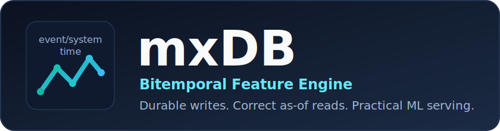

<p align="center">
  
</p>

<p align="center">
  <strong>A C++ bitemporal feature engine for ML systems that need correctness under late data and corrections.</strong>
</p>

<p align="center">
  <a href="LICENSE"></a>
  <a href="docs/implementation-backlog.md"></a>
  <a href=".github/workflows/python-wheels.yml"></a>
</p>

## What Is mxDB?

**mxDB** is a specialized feature database for machine learning workloads that require:

- low-latency latest feature serving
- historical retrieval by event-time range (`range`)
- durable ingest with WAL + deterministic replay
- operational controls (checkpoint, compaction, backup/restore)

This project follows the architecture and milestone plan documented in
[docs/](docs/README.md).

## Why It Exists

Most feature systems optimize either online serving or offline history.
mxDB focuses on both, with **bitemporal correctness** as a first-class requirement.

If data can arrive late, be revised, or be corrected, you need to answer:

- What was true in the world at time `T`? (`event_time`)
- What did the system know at time `T`? (`system_time`)

mxDB stores both timelines and resolves queries with explicit cutoffs.

## Current Capabilities

Implemented today:

- C++20 engine with CMake build
- SQLite metadata plane (feature registration + lookup)
- WAL with checksums, sync and group-commit durability modes
- partitioned in-memory apply path with idempotency by `write_id`
- immutable segment flush + manifest tracking
- internal engine support for as-of/PIT primitives (not yet public CLI/SDK APIs)
- checkpoints, conservative compaction, backup/restore
- admin/ops controls via `featurectl`
- Python SDK (`mxdb`) that calls `featurectl`
- current public v1 read API: `latest`, `get`, `range`
- wheel packaging path that bundles `featurectl`

See [docs/known-limitations.md](docs/known-limitations.md) for what is not done yet.

## Architecture At A Glance

```text
Producers -> Validation -> WAL -> Partition Apply -> Memtable + Latest Cache
                                      |                |
                                      |                +-> Immutable Segments -> As-Of/PIT
                                      +-> Recovery Replay
```

Main implementation modules:

- engine core: `engine/`
- process binaries: `server/process/`, `tools/featurectl/`
- planned RPC schemas: `proto/` (not current v1 runtime API)
- Python SDK: `sdk/python/`

## Install

### Option A: Python Users (recommended)

When published, install from PyPI:

```bash
pip install mxdb
```

The wheel bundles `featurectl` for target platforms, and `MXDBClient` auto-resolves it.

### Option B: Build From Source

```bash
cmake -S . -B build
cmake --build build -j8
ctest --test-dir build --output-on-failure
```

## Quickstart (CLI)

1. Create config:

```bash
cp deploy/config/featured.conf.example featured.conf
```

2. Register a feature:

```bash
build/featurectl featured.conf register prod f_price double
build/featurectl featured.conf register prod f_flag bool
build/featurectl featured.conf register prod f_note string
```

3. Write values:

```bash
build/featurectl featured.conf upsert prod AAPL f_price 100 101.5
build/featurectl featured.conf upsert prod AAPL f_flag 101 true
build/featurectl featured.conf upsert prod AAPL f_note 102 "opening print"
# optional stable write_id for retry-safe idempotency
build/featurectl featured.conf upsert prod AAPL f_price 100 101.5 price-100-v1
build/featurectl featured.conf delete prod AAPL f_price 103
```

CLI write signatures:

- `upsert <namespace> <entity_name> <feature_id> <event_us> <value> [write_id]`
- `delete <namespace> <entity_name> <feature_id> <event_us> [write_id]`

4. Read latest/snapshot/range values:

```bash
build/featurectl featured.conf latest prod AAPL f_price
build/featurectl featured.conf latest prod AAPL f_price 5
build/featurectl featured.conf get prod AAPL
# furthest only => open-ended after furthest
build/featurectl featured.conf range prod AAPL f_price 100
# bounded [furthest, latest], with memory-only source
build/featurectl featured.conf range prod AAPL f_price 100 200 memory
```

Supported CLI value types for `register`:
`double`, `int64`, `string`, `bool`, `float_vector`, `double_vector`.

5. Check health:

```bash
build/featurectl featured.conf health
```

## Quickstart (Python)

```python
from datetime import datetime, timezone, timedelta

from mxdb import MXDBClient

client = MXDBClient()

client.register_feature("prod", "f_price", "double")
client.register_feature("prod", "f_flag", "bool")
client.register_feature("prod", "f_note", "string")
client.register_feature("prod", "f_size", "int64")
client.register_feature("prod", "f_curve", "double_vector")

aapl = client.entity("prod", "AAPL")

base = datetime(2026, 3, 9, 12, 0, 0, tzinfo=timezone.utc)
aapl.upsert("f_price", base, 101.5)
aapl.upsert("f_price", base + timedelta(seconds=5), 102.0)
aapl.upsert("f_flag", base + timedelta(seconds=1), True)
aapl.upsert("f_note", base + timedelta(seconds=2), "starting coverage")
aapl.upsert("f_size", base + timedelta(seconds=3), 1_500_000)
aapl.upsert("f_curve", base + timedelta(seconds=4), [1.0, 2.5, 3.25])

latest = aapl.latest("f_price")
latest_history = aapl.latest("f_price", count=5)
snapshot = aapl.get()
bounded = aapl.get_range(
    "f_price", ("2026:03:09:12:00:05.000", "2026:03:09:12:00:00.000")
)
# latest omitted => everything after furthest
open_ended = aapl.get_range("f_price", "2026:03:09:12:00:00")
# disk=False => memory-only view
memory_only = aapl.get_range("f_price", (base + timedelta(seconds=10), base), disk=False)
# ISO-8601 + datetime range input works too
iso_range = aapl.get_range(
    "f_price",
    ("2026-03-09T12:00:05Z", base),
)
aapl.delete("f_price", base + timedelta(seconds=10))

print(latest)
print(latest_history)
print(snapshot)
print(bounded)
print(open_ended)
print(memory_only)
print(iso_range)
```

The Python SDK public read/write API is namespace + entity scoped:
`row = client.entity(namespace, entity_name)`.

`entity.latest(..., count=N)` returns up to `N` recent values.
Typed Python reads support: `bool`, `int64`, `double`, `string`, `float_vector`, `double_vector`.

Public write API is simplified:

- `entity.upsert(feature_id, event_time, value)`
- `entity.delete(feature_id, event_time)`

`system_time` is hidden in Python and generated automatically.
`write_id` is optional in Python: auto-generated by default, or caller-provided
for idempotent retries:
`entity.upsert(..., write_id="order-123-v1")`.

Return shapes:

- `entity.latest(..., count=1)` -> `TypedFeatureResult`
- `entity.latest(..., count>1)` -> `list[TypedFeatureResult]`
- `entity.get()` -> `dict[str, TypedFeatureResult]`
- `entity.get_range(...)` -> `list[TypedFeatureResult]`

`entity.get_range(feature_id, date_range, disk=True)`:

- `date_range=(latest, furthest)` returns values in `[furthest, latest]`
- `date_range=furthest` returns everything after furthest
- `disk=True` includes memory + immutable segments
- `disk=False` includes only in-memory values

For a larger end-to-end Python example that exercises all methods, see
[sdk/python/README.md](sdk/python/README.md).

### Binary Resolution Rules in Python SDK

`MXDBClient` resolves `featurectl` in this order:

1. explicit `featurectl_bin=` argument
2. `MXDB_FEATURECTL_BIN` environment variable
3. bundled wheel binary
4. `featurectl` on `PATH`

## Operational Guides

- Runbook: [docs/operational-runbook.md](docs/operational-runbook.md)
- Packaging + wheel bundling: [docs/python-packaging.md](docs/python-packaging.md)

Common commands:

```bash
build/featurectl featured.conf checkpoint
build/featurectl featured.conf compact
build/featurectl featured.conf backup /tmp/mxdb-backup
build/featurectl featured.conf readonly on
```

When read-only mode is enabled, memtables are flushed, writes are rejected, and compaction is blocked.

## Configuration

Example config: [deploy/config/featured.conf.example](deploy/config/featured.conf.example)

Key knobs:

- `partition_count`: internal partition fanout
- `default_durability_sync`: sync vs group-commit default
- `memtable_flush_event_threshold`: flush trigger
- `wal_segment_target_bytes`: WAL rotation size

Config parsing rules:

- missing config file is a hard startup error
- malformed numeric values are rejected with a config error
- relative paths in config values resolve against the config file directory

## Testing

Run all tests:

```bash
ctest --test-dir build --output-on-failure
```

Coverage includes:

- metadata validation
- WAL append/replay/truncation handling
- temporal selection semantics
- end-to-end write/read/recovery
- checkpoint recovery
- compaction equivalence
- admin ops + Python SDK flows

## Benchmarks

Baseline workload definition:

- [bench/workloads/latest-read-workload.md](bench/workloads/latest-read-workload.md)

Runner:

```bash
PYTHONPATH=sdk/python/src python3 tools/benchmark_runner.py \
  --config featured.conf \
  --featurectl-bin build/featurectl
```

## Documentation Index

- architecture index: [docs/README.md](docs/README.md)
- system spec: [docs/bitemporal-feature-engine-spec.md](docs/bitemporal-feature-engine-spec.md)
- API contracts: [docs/bitemporal-feature-engine-api-contracts.md](docs/bitemporal-feature-engine-api-contracts.md)
- implementation backlog: [docs/implementation-backlog.md](docs/implementation-backlog.md)
- definition of done: [docs/definition-of-done.md](docs/definition-of-done.md)

## Roadmap

Next major gaps to close:

1. gRPC server surfaces for ingest/serving/historical/admin APIs
2. Arrow-native historical materialization
3. stronger retention/tombstone policy enforcement
4. higher-performance PIT execution and richer benchmark suites

## Contributing

See [CONTRIBUTING.md](CONTRIBUTING.md).

## License

MIT - see [LICENSE](LICENSE).
