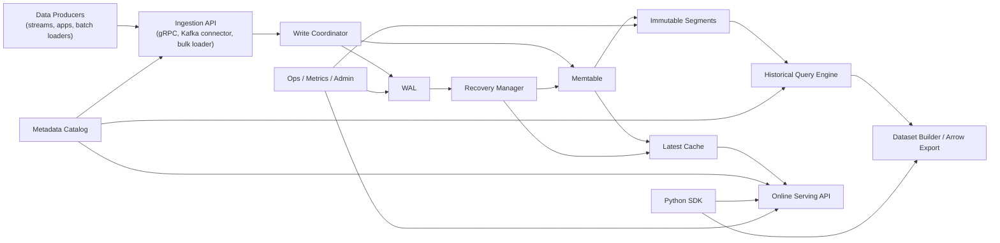
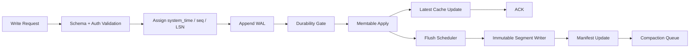
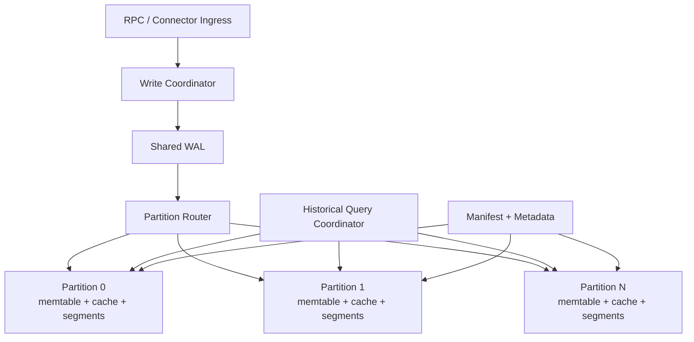
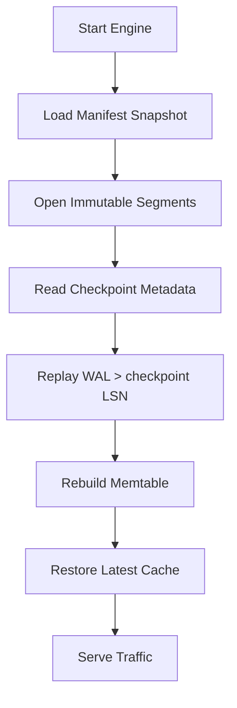
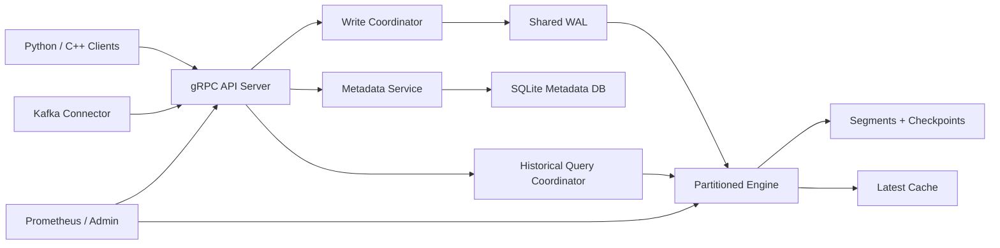

# Bitemporal Feature Engine: End-to-End System Specification

Status: Draft v1

This document specifies an end-to-end architecture for a specialized feature database for machine learning workloads that need:

- point-in-time correctness for offline training
- low-latency latest-value serving for online inference
- bitemporal history: both event time and system time
- real database behavior: WAL durability, crash recovery, checkpoints, compaction, backup, and operational observability

The design is intentionally more rigorous than a cache or a thin feature-store wrapper. The product is a storage and query engine with a serving layer and thin language bindings.

## 1. Executive Summary

The system is a bitemporal feature engine: a database built to store, retrieve, and serve ML features under two timelines:

- `event_time`: when a fact was true in the real world
- `system_time`: when the platform learned or recorded that fact

This distinction matters because many real datasets are corrected, delayed, backfilled, or revised after the fact. A normal "latest value" store cannot answer:

- "What was the feature value for this entity as of market close on March 15, 2024?"
- "What did the system know at that moment, before the late correction arrived?"

This engine can answer both.

It is designed for:

- quant and trading systems
- fraud and risk models
- recommender systems with late events
- industrial and IoT monitoring
- healthcare and claims data
- any ML team that needs leakage-safe historical feature retrieval plus fast online inference

The system is not meant to replace a warehouse, OLAP engine, or general relational database. It is a specialized feature database with narrow, strong semantics:

- latest lookup by entity
- time-travel reads
- point-in-time joins
- rolling window reads
- bounded derived feature computation
- durable ingestion and replay

The design has two architectural layers:

- `v1`: single-node durable engine with thin clients and APIs
- `v2`: distributed cluster with sharding, replication, and scale-out query execution

The single-node design is the foundation. The distributed design extends it without changing the logical model.

## 2. Product Positioning

### 2.1 What This System Is

This system is:

- a temporal storage engine for ML features
- a low-latency online feature server
- an offline historical retrieval engine for training set construction
- a metadata-aware registry for entities, features, and transformations

### 2.2 What This System Is Not

This system is not:

- a generic SQL data warehouse
- a full stream processor
- a feature engineering notebook platform
- a model registry
- a training orchestration system

The system may integrate with those tools, but it should not absorb their responsibilities.

### 2.3 Core Value Proposition

The product wins if it does five things better than general-purpose alternatives:

1. Makes temporal correctness the default.
2. Makes online reads extremely fast.
3. Treats late data and corrections as first-class, not edge cases.
4. Provides operationally boring durability and recovery behavior.
5. Exposes a clean Python-facing workflow while keeping the hot path in C++.

## 3. Primary Use Cases

### 3.1 Historical Training Dataset Construction

Given a table of labeled examples like:

```text
(entity_id, label_time, label)
```

the engine must produce feature values that satisfy both:

- `feature.event_time <= label_time`
- `feature.system_time <= training_cutoff`

This prevents lookahead leakage and correctly excludes late-arriving corrections that were not known yet.

### 3.2 Online Inference Serving

Given an entity identifier or request context, the engine must return the latest online feature vector in sub-millisecond to low-single-digit millisecond latency, depending on deployment topology and storage residency.

### 3.3 Audit and Time Travel

Users must be able to ask:

- what did we know then?
- when did we learn it?
- what value did a later correction replace?
- why did a model decision differ between two dates?

### 3.4 Backfill and Correction Handling

The system must safely ingest:

- out-of-order events
- corrected historical facts
- deletion or tombstone events
- replayed streams after upstream failure

### 3.5 Derived Features

The system should support bounded derived features such as:

- rolling averages
- counts
- z-scores
- ratios
- latest-of dependencies

without trying to become a general UDF platform in v1.

## 4. Design Principles

1. Temporal semantics first.
2. Durability before cleverness.
3. The hot path must stay in C++.
4. Python is a client surface, not the data plane.
5. Use immutable on-disk structures and append-first writes.
6. Prefer explicit narrow APIs over a fake "full SQL" story.
7. Single-node correctness and operability come before clustering.
8. Use columnar formats where they help scans, and indexed key lookups where they help serving.
9. Make correctness failures impossible by default and performance degradations observable.

## 5. Requirements

## 5.1 Functional Requirements

The engine must support:

- feature registration and schema management
- ingest of feature updates with event time and system time
- idempotent writes under retry and replay
- latest value retrieval by entity
- historical as-of retrieval
- point-in-time joins against a driving dataset
- bounded window reads
- deletion/tombstone semantics
- WAL-backed durability
- restart recovery
- background compaction
- data retention policies
- Arrow-native export paths
- Python SDK and gRPC APIs

## 5.2 Non-Functional Requirements

Initial targets for a credible v1:

- acknowledged writes survive crash under synchronous durability mode
- p99 online read under 1 ms for in-memory latest cache on colocated deployment
- p99 online read under 5 ms for remote gRPC within a single availability zone
- historical retrieval throughput sufficient to build training data faster than warehouse-based point-in-time join workflows
- checkpoint and recovery time bounded by WAL replay plus cache rebuild budgets
- predictable tail latency under background compaction

## 5.3 Explicit Non-Goals for v1

- arbitrary ANSI SQL support
- cross-tenant distributed joins
- full OLAP aggregation planner
- active-active multi-region replication
- general stream processing graph engine
- arbitrary user-defined Python execution inside the core engine

## 6. Terminology

- `entity`: the real-world object keyed in the feature store, such as a user, instrument, device, or merchant
- `feature`: a named value associated with an entity
- `event_time`: when the value was true in the domain
- `system_time`: when the system observed, accepted, or materialized that value
- `valid time`: synonym here for event time
- `ingest time`: the write-time assigned by the engine; typically the initial system time
- `revision`: a later value for the same event time recorded at a newer system time
- `as-of query`: a query constrained by both event-time and system-time cutoffs
- `latest view`: current online-serving snapshot per entity
- `point-in-time join`: joining a label dataset to feature histories without future leakage
- `tombstone`: a deletion marker

## 7. High-Level System Architecture

The end-to-end system is split into:

- metadata/control plane
- ingestion plane
- storage/query plane
- online serving plane
- SDK/connectors
- operations and observability plane



## 7.1 Control Plane vs Data Plane

The separation matters.

### Control Plane Responsibilities

- feature registry
- schema validation rules
- entity type definitions
- transformation definitions
- retention policies
- access control metadata
- deployment and tenant configuration

### Data Plane Responsibilities

- write path
- durability
- cache maintenance
- historical scans
- as-of query execution
- low-latency serving

The control plane may be embedded in v1, but conceptually it is separate. This avoids designing the core engine around UI or workflow concerns.

## 8. Logical Data Model

The logical model is append-only and versioned.

## 8.1 Core Entities

### Feature Definition

```text
feature_definition(
  tenant_id,
  feature_id,
  feature_name,
  entity_type,
  value_type,
  serving_enabled,
  historical_enabled,
  retention_policy,
  nullability,
  transform_spec,
  tags,
  created_at,
  updated_at
)
```

### Entity Key

Entities are scoped by tenant and type:

```text
entity_key = (tenant_id, entity_type, entity_id)
```

### Feature Event Record

This is the core immutable record:

```text
feature_event(
  tenant_id,
  entity_type,
  entity_id,
  feature_id,
  event_time,
  system_time,
  sequence_no,
  op,
  value,
  quality_flags,
  source_id,
  write_id,
  checksum
)
```

Where:

- `sequence_no` breaks ties within the same event/system timestamp pair
- `op` is `UPSERT` or `DELETE`
- `write_id` is an idempotency key
- `quality_flags` encode freshness, missingness, correction, inferred, or upstream validation issues

## 8.2 Bitemporal Semantics

The engine stores facts along two axes.

Example:

```text
entity = AAPL
feature = rolling_vol_30d

Version 1:
  event_time  = 2026-03-01 10:00:00
  system_time = 2026-03-01 10:00:02
  value       = 0.221

Version 2 (correction):
  event_time  = 2026-03-01 10:00:00
  system_time = 2026-03-01 10:04:15
  value       = 0.219
```

The engine must preserve both.

Query answers depend on both cutoffs:

- as of `event_time=10:03` and `system_time=10:03`, answer is `0.221`
- as of `event_time=10:05` and `system_time=10:05`, answer is `0.219`

## 8.3 Version Selection Rule

For an as-of lookup:

1. Select records matching tenant, entity, and feature.
2. Filter to `event_time <= query_event_cutoff`.
3. Filter to `system_time <= query_system_cutoff`.
4. Choose the record with maximal `(event_time, system_time, sequence_no)`.
5. If the chosen record is a tombstone, the result is missing.

This is the core rule the whole engine exists to implement.

## 8.4 Idempotency and Deduplication

Producers may retry writes. The system must support idempotency through:

- producer-assigned `write_id`
- source stream offsets where applicable
- WAL-level dedupe for recent write windows
- compaction-time duplicate suppression

The contract should be "at least once ingestion, exactly once visible state when write identifiers are used correctly."

## 9. Query Model

The product should expose a focused query model, not a broad SQL claim.

## 9.1 Query Types

### Latest Lookup

Retrieve current online-serving values for an entity or batch of entities:

```text
get_latest(
  tenant_id,
  entity_type,
  entity_ids[],
  feature_ids[],
  freshness_requirement?,
  consistency_mode?
)
```

### As-Of Lookup

Retrieve feature values under explicit temporal cutoffs:

```text
get_as_of(
  tenant_id,
  entity_type,
  entity_ids[],
  feature_ids[],
  event_cutoff,
  system_cutoff
)
```

### Point-in-Time Join

Given a driving table:

```text
join_features(
  driving_table[
    row_id,
    entity_id,
    label_time,
    optionally_system_cutoff
  ],
  feature_ids[],
  default_system_cutoff = label_time or training_snapshot_time,
  join_mode = EXACT_ENTITY
)
```

### Window Read

Retrieve time-bounded histories:

```text
scan_window(
  tenant_id,
  entity_type,
  entity_id,
  feature_id,
  event_start,
  event_end,
  system_cutoff
)
```

### Audit History

Retrieve all revisions for a given event interval:

```text
audit_history(
  tenant_id,
  entity_type,
  entity_id,
  feature_id,
  event_start,
  event_end
)
```

## 9.2 Optional SQL Surface

The engine should provide a narrow SQL adapter for convenience, but SQL is not the primary contract.

A reasonable SQL surface:

```sql
SELECT *
FROM feature_as_of(
  tenant => 'prod',
  entity_type => 'instrument',
  entity_id => 'AAPL',
  feature_names => ['rolling_vol_30d', 'order_imbalance'],
  event_cutoff => TIMESTAMP '2026-03-01 10:03:00',
  system_cutoff => TIMESTAMP '2026-03-01 10:03:00'
);
```

The SQL layer should compile into engine-native operators, not introduce a general-purpose planner in v1.

## 10. API Surface

## 10.1 Ingestion API

Support three write entry points:

1. gRPC unary and streaming writes
2. Kafka connector for stream-driven ingestion
3. bulk file import for backfills

The core internal write request:

```text
WriteFeatureEventsRequest {
  tenant_id
  entity_type
  events[] {
    entity_id
    feature_id
    event_time
    optional system_time
    value
    op
    write_id
    quality_flags
    source_id
  }
  durability_mode
}
```

If `system_time` is omitted, the server stamps it on acceptance.

## 10.2 Online Read API

```text
GetLatestFeaturesRequest {
  tenant_id
  entity_type
  entity_ids[]
  feature_ids[]
  freshness_requirement_ms
  consistency_mode
}
```

Response format should support:

- protobuf for RPC transport
- Arrow record batch for batch retrieval
- shared-memory reference for colocated clients

## 10.3 Historical API

```text
BuildTrainingDatasetRequest {
  tenant_id
  entity_type
  driving_table_ref
  feature_ids[]
  event_time_column
  optional system_time_column
  output_format
  output_location
}
```

This API is asynchronous for large jobs.

## 10.4 Admin API

The admin plane should manage:

- feature registration
- compaction controls
- retention policy changes
- checkpoint control
- backup and restore commands
- metrics and health endpoints

## 10.5 Transaction and Batch Semantics

The system should be explicit about what is and is not atomic.

### Single-Entity Batch Writes

All events for the same `(tenant_id, entity_type, entity_id)` in one request should be treated as one atomic unit:

- one WAL append batch
- one visibility point
- one latest-cache publication boundary

This is sufficient for most feature ingestion, because all features for one entity naturally map together.

### Multi-Entity Batch Writes

For v1, multi-entity requests are a transport optimization, not a transaction:

- each entity batch may commit independently
- response returns per-entity or per-record status
- no cross-entity atomicity guarantee

This keeps the engine simple and lines up with the partitioning model.

### Historical Jobs

Historical dataset builds are snapshot-consistent with respect to:

- manifest version
- WAL replay boundary or checkpoint watermark
- explicit system-time cutoff

They are not blocked by concurrent writes; they run against a pinned snapshot.

## 10.6 Admission Control and Backpressure

The API layer must enforce backpressure before the engine becomes unstable.

Required controls:

- max in-flight write bytes
- max in-flight historical job memory
- per-tenant QPS and bandwidth quotas
- bounded WAL queue depth
- bounded compaction backlog alerts

When a limit is hit, the system should:

- reject non-critical writes with retryable overload errors
- shed or queue low-priority historical jobs
- preserve online serving headroom

Online serving is the highest-priority path. Background work must degrade first.

## 11. Storage Engine Architecture

The core engine is log-structured with a hybrid in-memory and immutable-segment design.

The write path is:

1. validate request against metadata
2. assign `system_time`, `sequence_no`, and internal LSN
3. append to WAL
4. fsync according to durability policy
5. apply to memtable
6. update latest cache
7. ACK
8. flush memtable to immutable segment asynchronously



## 11.0 Storage Node Internal Architecture

One node should not be designed as a single giant lock-protected data structure. It should be internally partitioned.

### Local Partition Model

Within a node, data is divided into `P` local partitions by:

```text
partition_id = hash(tenant_id, entity_type, entity_id) % P
```

Each partition owns:

- a memtable
- a latest cache shard
- immutable segment set
- flush queue
- compaction queue
- local query executors for partition-scoped work

Node-wide components remain shared:

- metadata catalog
- WAL
- manifest
- RPC ingress
- admin endpoints

This gives a clean balance:

- node-wide durability and recovery stay simple
- hot data paths scale across cores
- the future distributed shard model looks similar to the local partition model



### Why Shared WAL in v1

v1 should use one node-wide WAL rather than per-partition WALs.

Benefits:

- simpler crash recovery
- one durability pipeline
- one global commit ordering
- easier checkpointing

Tradeoff:

- WAL append can become a throughput bottleneck

That is acceptable in v1 because:

- batch append amortizes cost
- the first hard problem is correctness, not maximum write scaling
- a distributed design can move to shard-local WALs later if needed

## 11.0.1 Threading and Execution Model

The node should use role-specific executors rather than a single generic thread pool.

Recommended threads or executors:

- network ingress threads for gRPC and connector IO
- one WAL writer thread or tightly controlled WAL append group
- one apply queue per partition
- flush workers for memtable-to-segment conversion
- compaction workers with IO and CPU budgets
- query executor pool for historical scans and joins
- admin and metrics threads

### Write Execution Model

1. ingress thread parses and validates request
2. write coordinator assigns metadata and sends batch to WAL appender
3. WAL appender serializes commit order
4. after durability gate, record is routed to owning partition apply queue
5. partition worker mutates memtable and publishes latest-cache snapshot
6. ACK completes after partition apply visibility

This avoids heavy fine-grained locking in the write path.

### Read Execution Model

- latest reads go directly to partition cache shard
- historical queries are planned centrally but executed in partition-local tasks
- batch results merge at the coordinator

### Background Work Isolation

Compaction and flush workers must run under explicit CPU and IO quotas so they cannot consume all resources during load spikes.

## 11.0.2 Memory Management Strategy

The engine needs deliberate memory budgeting.

Recommended memory classes:

- WAL buffers
- mutable memtables
- immutable memtables waiting to flush
- latest cache snapshots
- query execution buffers
- shared-memory serving arena
- compaction scratch space

Hard limits should exist for each class.

If memory pressure rises:

1. stop admitting large historical jobs
2. force memtable rotation
3. increase flush priority
4. shed optional caches before harming correctness

The latest cache should be size-aware and optionally tiered by feature group criticality.

## 11.1 Why Log-Structured

A log-structured design fits the workload:

- writes are append-heavy
- corrections arrive over time
- old versions must be preserved
- scans benefit from immutable sorted structures
- recovery is straightforward with WAL + manifest

## 11.2 WAL Design

The WAL is the durability backbone.

### WAL Requirements

- append-only
- checksummed
- segment-rotated
- replayable in order
- idempotent under partial recovery
- independent of compaction

### WAL Record Layout

```text
WALRecordHeader {
  magic
  version
  record_type
  length
  lsn
  crc32c
}

WALFeatureEventPayload {
  tenant_id
  entity_type
  entity_id
  feature_id
  event_time
  system_time
  sequence_no
  op
  value_encoding
  value_bytes
  write_id
  source_id
  quality_flags
}
```

### WAL Segment Rules

- fixed-size or target-size segment files
- rolling on size or time thresholds
- footer summarizing min/max LSN and checksum
- manifest entry after segment close
- preallocation optional to reduce fragmentation
- fsync policy must include both data file and directory entry semantics where the platform requires it

### Durability Modes

- `SYNC`: fsync before ACK
- `GROUP_COMMIT`: batch fsync every N ms or M records
- `ASYNC`: append and return before fsync; only for lower-tier environments

Default production mode should be `GROUP_COMMIT` with a small bounded window.

## 11.3 Memtable Design

The memtable holds recent unflushed state.

Recommended structure:

- concurrent skiplist or ART/B-tree variant keyed by
  `(tenant, entity_type, entity_id, feature_id, event_time desc, system_time desc, sequence_no desc)`
- append-optimized allocator / arena
- immutable freeze on flush

The memtable is not the only serving state. It is a write buffer and a short-range query source.

### Memtable Rotation

When a memtable hits a size or age threshold:

1. it is frozen
2. a new mutable memtable becomes active
3. the frozen memtable enters the flush queue

Reads must consult:

- active memtable
- immutable memtables pending flush
- on-disk segments

This is standard but important for correctness under concurrent writes and flushes.

## 11.4 Latest Cache Design

The latest cache is optimized for online reads.

Each cache entry contains the resolved latest vector for an entity, for serving-enabled features only.

### Cache Representation

```text
latest_cache[tenant_id, entity_type, entity_id] -> FeatureVectorSnapshot*
```

Where `FeatureVectorSnapshot` is immutable after publication.

Update strategy:

1. copy or build a new feature vector snapshot
2. atomically swap pointer
3. reclaim old snapshot through epoch-based reclamation or hazard pointers

This gives:

- lock-free reads
- deterministic visibility
- no partial vector updates to readers

### Why Separate Latest Cache from Historical Store

Because the access patterns are different:

- online inference wants packed latest state with tight latency
- historical joins want ordered timelines and scan pruning

Trying to use one structure for both leads to worse behavior for each.

### Feature Group Packing

For serving, features should be packable into named feature groups:

- group all features needed by a given model or service
- publish one compact vector per entity per feature group
- avoid rebuilding giant all-feature vectors when only one model cares

This improves:

- cache density
- update cost
- shared-memory usability

The metadata registry should allow one feature to belong to multiple serving groups if needed.

## 11.5 On-Disk Segment Design

Flushed memtables become immutable segments.

Segments should be:

- sorted by primary key
- self-describing
- checksummed
- mmappable where appropriate
- split into metadata, index, and data blocks

### Segment Key Order

Logical ordering:

```text
(tenant_id,
 entity_type,
 entity_id,
 feature_id,
 event_time DESC,
 system_time DESC,
 sequence_no DESC)
```

Descending temporal order is intentional. It accelerates "find newest value before cutoff" operations.

### Segment Physical Layout

Recommended layout:

```text
Segment File
  Header
  Schema dictionary
  Zone map metadata
  Block index
  Key block(s)
  Value block(s)
  Optional columnar projection block(s)
  Bloom filters / existence filters
  Footer
```

### Hybrid Row + Column Strategy

For v1, the best design is hybrid:

- key index and revision chain stored in row-wise sorted blocks for as-of lookups
- optional columnar projections for value-heavy scans and Arrow export

Pure columnar is awkward for hot bitemporal point retrieval.
Pure row-store underdelivers on large training scans.
Hybrid segments are the right tradeoff.

## 11.6 Segment Metadata and Pruning

Each segment tracks:

- tenant/entity/feature coverage
- min/max event time
- min/max system time
- row count
- tombstone count
- compression scheme
- bloom filters for entity/feature membership

This supports pruning before touching data blocks.

## 11.7 Manifest

The manifest is the durable catalog of engine state:

- active WAL segments
- immutable segment list
- compaction outputs
- checkpoint metadata
- retention watermarks
- format versions

Manifest updates must be atomic. A common pattern is append-only manifest records with periodic snapshots.

## 11.8 On-Disk Directory Layout

The storage layout on disk should be explicit from the start.

Recommended structure:

```text
data/
  node_id/
    manifest/
      manifest.log
      manifest.snapshot
    wal/
      wal-000001.log
      wal-000002.log
    checkpoints/
      checkpoint-000123/
    segments/
      partition-000/
      partition-001/
      ...
    catalog/
      metadata.db
    tmp/
      compaction/
      restore/
```

Rules:

- immutable segment files are never modified in place
- compaction writes new files, then atomically swaps manifest state
- temporary files are distinguishable and safe to clean after crash recovery

## 11.9 Encoding and Type System

The feature engine should not begin with an unbounded type system.

Recommended v1 supported types:

- `bool`
- `int32`, `int64`
- `float32`, `float64`
- `string`
- fixed-length numeric vector
- nullable variants of the above

Additional complex types can follow later.

Storage guidance:

- fixed-width types stored inline where possible
- variable-width values stored with offset tables
- fixed-length vectors encoded contiguously for fast serving
- nullability represented separately from tombstones

Tombstones mean "no value should be visible."
Null means "value exists but is unknown or intentionally null."

## 12. Indexing Strategy

The engine needs more than one index conceptually, even if they share files.

## 12.1 Primary Temporal Index

Supports:

- as-of lookup by entity and feature
- historical scans for one entity/feature pair

Primary key:

```text
(tenant, entity_type, entity_id, feature_id, event_time desc, system_time desc, sequence_no desc)
```

## 12.2 Entity-Scoped Latest Index

Supports:

- get latest vector for entity

Stored primarily in memory as the latest cache.
Optionally persisted in checkpoint snapshots for fast recovery.

## 12.3 Segment Existence Filters

Bloom or xor filters indicate whether a segment may contain:

- a given entity
- a given feature
- a given entity-feature pair

This reduces unnecessary reads for sparse workloads.

## 12.4 Optional Time Partitioning

For large historical stores, time partitioning by coarse event-time buckets may be used to reduce scan scope. This must not break cross-bucket as-of lookup semantics.

## 13. Query Engine Design

The query engine is operator-based, not SQL-first.

Core operators:

- `LatestVectorLookup`
- `AsOfLookup`
- `TimelineScan`
- `PointInTimeJoin`
- `WindowAggregate`
- `Project`
- `Filter`
- `ArrowMaterialize`

## 13.1 Latest Lookup Execution

Path:

1. look up entity in latest cache
2. validate freshness constraints
3. if missing or stale, optionally consult memtable and segments
4. return packed vector

The fast path should avoid touching disk.

## 13.2 As-Of Lookup Execution

Given `(entity, feature, event_cutoff, system_cutoff)`:

1. inspect memtable for matching revisions
2. inspect candidate immutable segments selected by entity/feature filter and time pruning
3. within each candidate, locate highest revision not exceeding cutoffs
4. merge candidate answers across memtable and segments
5. return the maximum valid version

A loser-tree or heap merge across candidate iterators is appropriate.

## 13.3 Point-in-Time Join Algorithm

This is the defining operator.

Inputs:

- driving rows `(row_id, entity_id, label_time, optional system_cutoff)`
- feature set

Output:

- one output row per driving row with resolved feature values

Execution strategy for v1:

1. sort or bucket driving rows by entity and label time
2. group requested features by physical layout and segment locality
3. for each entity-feature combination, scan timelines once in descending time order
4. advance driving row cursors to resolve maximal revision under cutoffs
5. materialize Arrow batches incrementally

This is closer to a merge over sorted timelines than to repeated key lookups. Repeated point lookups will not scale well for dataset builds.

### Vectorized PIT Join

The query engine should operate on batches:

- batch driving rows into Arrow arrays
- resolve timestamps in tight loops
- keep value decoding vectorized where possible

### Join Semantics

Default semantics should be left join with null fill:

- no matching revision before cutoffs -> null
- tombstoned current version -> null

Configurable options:

- require full feature presence or fail
- apply feature-specific default value
- surface quality flags in output

## 13.4 Window Reads and Rolling Aggregates

The engine should support bounded windows for:

- rolling mean
- rolling sum
- count
- min/max
- last-N events

These should operate over event time, constrained by system-time visibility.

Example:

"30-minute rolling mean as of event time T and system time S" means:

- scan events where `T - 30m < event_time <= T`
- include only versions with `system_time <= S`
- use the visible revision for each contributing event

This can get expensive. For v1, support built-in window operators only for frequently used cases.

## 13.5 Derived Features

Derived features should be explicitly classified:

### Materialized Derived Features

Computed during ingestion or background jobs and stored as first-class feature events.

Best for:

- high-read, low-computation formulas
- serving-critical features

### Read-Time Derived Features

Computed at query time from a bounded dependency graph.

Best for:

- light arithmetic
- freshness-sensitive combinations

### v1 Rule

Only allow deterministic, bounded, engine-native transforms in v1. No arbitrary Python UDFs in the core.

## 13.6 Minimal Query Optimization

The engine needs a narrow optimizer, not a general one.

Optimization tasks:

- prune segments by tenant/entity/feature/time
- choose cache vs memtable vs segment lookup path
- batch requests by locality
- decide whether to use projected column blocks
- reorder feature retrieval for fewer scans

## 14. Compaction, Retention, and Garbage Collection

Compaction is mandatory in a log-structured engine.

## 14.1 Compaction Goals

- merge overlapping segments
- reduce read amplification
- eliminate duplicate writes
- coalesce obsolete revisions under retention policy
- rebuild bloom filters and summaries

## 14.2 Bitemporal Retention Rules

Retention is subtle because old revisions may still be needed.

Possible policies:

- keep all revisions forever
- keep full bitemporal history for N days
- keep last K revisions per event
- keep only latest visible revision after audit window expires

For regulated and audit-heavy users, aggressive revision pruning is dangerous. The default should be conservative.

## 14.3 Compaction Safety Rules

Compaction may only drop a revision if policy proves it can never affect an allowed query result.

That requires considering:

- event-time windows
- system-time audit windows
- legal retention requirements
- recovery state

## 14.4 Tombstone Handling

Deletes become tombstones. Compaction may physically purge deleted state only after all relevant retention and visibility windows pass.

## 15. Checkpointing and Recovery

The system must behave like a database on restart.

## 15.1 Checkpoint Design

A checkpoint captures:

- manifest snapshot
- memtable snapshot or flush boundary
- latest cache snapshot metadata
- last durable LSN

Two viable approaches:

### Approach A: Flush-Based Checkpoint

- freeze memtable
- flush it to segment
- persist manifest snapshot
- record durable LSN

This is simpler and preferred for v1.

### Approach B: Snapshot-Based Checkpoint

- snapshot mutable structures without full flush
- replay WAL from checkpoint LSN

This reduces write disruption but is more complex.

## 15.2 Recovery Sequence

On startup:

1. load latest valid manifest snapshot
2. discover immutable segments
3. load checkpoint metadata
4. replay WAL records after checkpoint LSN
5. rebuild memtable
6. rebuild or lazily warm latest cache
7. mark engine ready for reads



## 15.3 Recovery Guarantees

Under synchronous durability:

- no acknowledged write is lost
- duplicate replay does not create duplicate visible state if idempotency keys are present
- partial WAL tail corruption is detected and truncated to last valid record

## 15.4 Fast Recovery Considerations

To bound restart time:

- checkpoint regularly
- snapshot latest cache metadata or persist latest index hints
- support lazy cache warming
- parallelize WAL replay and cache rebuild where safe

## 16. Serving Layer Design

The serving layer exposes the online path.

## 16.1 Transport Options

- gRPC for networked consumers
- shared memory for colocated low-latency consumers
- optional C++ embedded library mode for in-process usage

## 16.2 gRPC Serving

gRPC is the default interoperable transport.

Benefits:

- language-neutral
- streaming support
- TLS and auth ecosystem
- observability tooling

Costs:

- serialization overhead
- memory copies unless carefully designed

For most teams, gRPC is enough. Shared memory is for the highest-performance colocated deployments.

## 16.3 Shared Memory Serving

The shared-memory path is an optimization layer, not the primary system contract.

### Shared Memory Use Case

- inference process and engine on same machine
- request rate high enough that serialization cost matters
- strict tail latency requirements

### Shared Memory Model

Expose immutable feature vector pages in shared memory:

1. engine maintains a shared-memory arena
2. latest cache snapshot publication also publishes offsets into arena
3. local client maps the shared segment read-only
4. client reads vector contents with version stamp validation

Key invariants:

- readers never observe partially written vectors
- published snapshots are immutable
- memory reclamation is epoch-based

### Why Not Make Shared Memory the Only Serving Path

Because it complicates deployment and security, and most users need remote RPC anyway.

## 16.4 Latency Budget

For a colocated latest lookup:

- request parsing / dispatch: 10-50 us
- entity lookup: 10-30 us
- vector materialization or pointer fetch: 10-50 us
- serialization: 0 us shared memory, 50-200 us gRPC/protobuf typical

The architecture should preserve a sub-millisecond budget on the fast path.

## 16.5 Serving Consistency Modes

Recommended read modes:

- `LATEST_VISIBLE`: current published snapshot
- `AT_LEAST_LSN`: block until writes up to an LSN are visible
- `BEST_EFFORT_FRESH`: return latest if within freshness bound

This allows clients to choose between latency and visibility constraints.

## 17. Metadata and Control Plane

The metadata layer is how users reason about features as a product, not just rows in storage.

The metadata plane should be architecturally separate even if it shares a process with the data plane in v1.

## 17.1 Metadata Objects

- tenants
- entity types
- features
- feature groups
- transformation specs
- retention policies
- access control policies
- serving profiles
- ingestion sources

## 17.2 Feature Registry Requirements

Each feature definition should include:

- name and description
- type and encoding
- owner and tags
- serving enabled flag
- retention class
- source of truth
- dependency graph for derived features
- freshness SLA
- data quality expectations

## 17.3 Schema Evolution

Schema changes must be explicit and versioned.

Safe evolution examples:

- add new feature
- widen integer type
- add tags or metadata

Riskier changes:

- changing entity key semantics
- changing feature type incompatibly
- changing transform behavior retroactively

The registry should reject unsafe changes by default.

## 17.4 Metadata Persistence Design

Metadata traffic is tiny compared with feature traffic, so the control plane does not need the same storage engine.

Recommended v1 design:

- store control-plane metadata in embedded SQLite
- wrap it in a typed C++ metadata service layer
- treat metadata changes as transactional and low-frequency

Why this is the right tradeoff:

- avoids building two databases at once
- gives reliable transactions for registry state
- keeps the specialized engine focused on feature data

The metadata store should hold:

- tenants
- feature definitions
- feature groups
- transform specs
- auth and ACL mappings
- retention policies
- source connector definitions

The engine manifest and WAL remain separate from metadata.db. They serve different purposes.

## 17.5 Data Quality and Freshness Contracts

Feature definitions should be able to declare:

- maximum tolerated staleness
- whether null is allowed
- accepted source list
- expected event-time lag distribution
- monotonicity constraints where relevant

The ingestion and serving layers should expose violations as quality flags rather than silently hiding them.

## 18. Python SDK and Language Bindings

The engine should be easy to adopt from Python while keeping logic out of Python.

## 18.1 SDK Responsibilities

- feature registration APIs
- ingestion client
- online lookup client
- historical dataset requests
- Arrow/Pandas/Polars conversion helpers
- auth and config handling

## 18.2 SDK Non-Responsibilities

- local feature computation engine
- fallback storage layer
- business logic replication

## 18.3 Data Exchange Format

Use Arrow as the canonical batch interchange format for:

- historical export
- batch online retrieval
- zero-copy handoff into Python analytics libraries where possible

This is a major adoption advantage.

## 18.4 Connector Contract

All connectors should be thin adapters over the same core APIs.

They should not implement their own:

- point-in-time logic
- deduplication semantics
- system-time assignment rules
- feature registry interpretation

If connector behavior diverges from core engine behavior, temporal correctness will drift.

## 19. Connectors and Ecosystem Integrations

End-to-end usability requires connectors.

Recommended connectors:

- Kafka source connector
- file import for Parquet/Arrow/CSV
- DuckDB table function or connector
- Polars integration via Arrow
- optional Spark connector for large-scale driving datasets

The database should remain the system of record for features; connectors should not duplicate logic in incompatible ways.

## 20. Security, Isolation, and Multi-Tenancy

Even if v1 is single-tenant by deployment, the design should anticipate isolation.

## 20.1 Security Requirements

- TLS for network traffic
- token or mTLS-based auth
- tenant scoping in every request
- audit logs for admin operations
- encryption at rest for WAL and segments where required

## 20.2 Multi-Tenancy Models

### Logical Multi-Tenancy

- shared engine
- tenant_id in all keys
- quota and isolation controls

### Physical Multi-Tenancy

- one deployment per tenant or environment

v1 can start with physical isolation, but logical tenancy should exist in the key model.

## 20.3 Resource Isolation

Need controls for:

- max ingest rate per tenant
- query concurrency
- cache quotas
- compaction IO budgets

## 21. Observability and Operations

A serious system needs first-class observability.

## 21.1 Metrics

Required metrics:

- ingest QPS
- ACK latency by durability mode
- WAL append latency
- WAL fsync latency
- memtable size and flush frequency
- compaction backlog and throughput
- latest cache hit rate
- online lookup latency
- historical query throughput
- segment count and read amplification
- checkpoint duration
- recovery duration
- stale data rate vs freshness SLAs

## 21.1.1 Health States

The node should expose machine-readable health states:

- `HEALTHY`
- `DEGRADED_WRITES`
- `DEGRADED_READS`
- `COMPACTION_BACKLOG`
- `RECOVERING`
- `READ_ONLY`

These states should be derived from explicit thresholds, not ad hoc log inspection.

## 21.2 Structured Logging

Structured logs should cover:

- write acceptance and rejection
- recovery steps
- checkpoint and compaction lifecycle
- schema changes
- authentication events
- query failures and timeouts

## 21.3 Tracing

Distributed tracing should span:

- ingestion request
- WAL commit
- query planning
- segment reads
- cache miss fallback
- response serialization

## 21.4 Admin Tooling

Operators need:

- health endpoints
- compaction status
- checkpoint trigger and status
- backup trigger and restore tooling
- retention inspection
- cache memory inspection

## 22. Backup, Restore, and Disaster Recovery

This is separate from crash recovery.

## 22.1 Backup Scope

Backups must include:

- manifest snapshots
- immutable segments
- metadata catalog
- WAL required since last checkpoint or backup boundary

## 22.2 Restore Workflow

1. restore manifest and segments
2. restore metadata
3. replay retained WAL if needed
4. verify checksums and watermarks
5. resume service in read-only or read-write mode

## 22.3 Disaster Recovery Targets

These are deployment-specific, but the system should document:

- RPO by durability mode
- RTO by data size and checkpoint cadence
- backup consistency guarantees

## 23. Deployment Topologies

## 23.1 Embedded Mode

The engine runs in-process with the application.

Pros:

- lowest latency
- simplest deployment

Cons:

- reduced isolation
- harder upgrades

Suitable for:

- experiments
- single-service colocated inference

## 23.2 Single-Node Service Mode

The engine runs as a standalone service on one machine.

Pros:

- strong operational simplicity
- easiest credible v1

Cons:

- limited scale and availability

This should be the initial product target.

## 23.3 Split Service Mode

Separate processes for:

- metadata/control plane
- storage/query server
- ingestion workers

Useful once the product grows, but can still be on one host.

## 23.4 Recommended v1 Deployment Diagram



## 24. Distributed Architecture (v2)

The logical model should survive scale-out.

## 24.1 Why Distributed v2, Not v1

Distributed systems multiply complexity:

- consensus
- replica lag
- query routing
- compaction coordination
- rebalancing
- failure modes

The core product risk is not "can it shard" but "is the semantics and local engine actually correct and fast."

## 24.2 Sharding Strategy

Shard primarily by:

```text
(tenant_id, entity_type, entity_id_hash)
```

This keeps:

- latest vectors local to one shard
- most point lookups local
- per-entity timelines local

Historical dataset builds that touch many entities become multi-shard fan-out jobs.

## 24.3 Replica Roles

Per shard:

- one leader for writes
- one or more followers for failover and read scale

Replication should be WAL-based.

## 24.4 Distributed Write Path

1. route write to shard leader
2. append to leader WAL
3. replicate WAL record to quorum or designated followers
4. commit according to durability policy
5. apply locally
6. ACK

Consensus protocol choice can be Raft or an equivalent replicated log. Do not invent a novel consensus layer.

## 24.5 Distributed Query Routing

### Latest Reads

Route by entity hash to one shard.

### Historical Reads

Options:

- coordinator fans out to relevant shards
- batch dataset builder runs near data

The second option is better for large PIT joins.

## 24.6 Rebalancing

Need support for:

- adding nodes
- moving shard ranges
- preserving snapshot consistency during migration

This is a later-stage problem and should not distort v1 storage design.

## 25. Consistency Model

## 25.1 Write Consistency

Within a single node:

- writes become visible after WAL durability gate and cache publication
- monotonic visibility by LSN

In distributed mode:

- writes visible after leader commit
- follower visibility may lag unless read-your-writes mode is requested

## 25.2 Read Consistency

The system should define read behavior explicitly:

- online latest reads are linearizable only in single-node mode unless distributed read protocol enforces otherwise
- historical queries execute against a snapshot defined by manifest state and system-time cutoff

## 25.3 Snapshot Semantics

Historical jobs should pin:

- manifest version
- checkpoint/LSN boundary
- explicit system-time cutoff

This guarantees repeatable dataset generation.

## 25.4 Batch Visibility Rules

For a successful single-entity batch write:

- either all records in that batch become visible together
- or none do

Visibility boundary:

- online latest cache sees one publication event
- historical queries at or after the commit watermark see the whole batch

This matters when multiple features must correspond to one event snapshot.

## 26. Detailed End-to-End Flows

## 26.1 End-to-End Write Flow

Input event:

```text
entity_id = AAPL
feature_id = order_book_imbalance
event_time = 2026-03-08T14:30:00.250Z
value = 0.13
write_id = source-17-offset-8812
```

Steps:

1. client sends event over gRPC or connector
2. ingestion layer validates tenant, feature existence, value type, and auth
3. write coordinator stamps `system_time` and internal `sequence_no`
4. coordinator appends WAL record and waits per durability mode
5. memtable applies record
6. latest cache recomputes entity snapshot if feature is serving-enabled
7. request ACKs with committed LSN
8. background flush later writes memtable contents into immutable segment

## 26.2 End-to-End Historical Join Flow

Input:

- training rows with `(row_id, entity_id, label_time)`
- requested feature set
- training snapshot system cutoff

Steps:

1. historical query API receives dataset request
2. planner resolves feature metadata and physical layout
3. driving rows are partitioned by entity hash or sorted by entity and label time
4. engine prunes segments by entity/feature/time range
5. PIT join operator scans timelines and resolves visible revisions
6. results materialize in Arrow batches
7. batches stream to client or persist to output storage
8. job metadata records manifest version and cutoff for reproducibility

## 26.3 End-to-End Crash Recovery Flow

1. engine restarts after crash
2. manifest snapshot loaded
3. immutable segments reopened
4. checkpoint LSN determined
5. WAL replay starts after checkpoint LSN
6. partial tail record, if any, is discarded after checksum failure
7. memtable state reconstructed
8. latest cache rebuilt from replayed records or loaded snapshot
9. serving resumes

## 26.4 End-to-End Shared Memory Read Flow

1. colocated client maps shared arena
2. client asks engine control socket or gRPC for current vector descriptor
3. engine returns `(entity_version, offset, length, format)`
4. client validates descriptor version
5. client reads immutable vector directly
6. client revalidates version if needed for lock-free safety

## 27. Performance Engineering Strategy

The project will only be credible if performance claims are measured and repeatable.

## 27.1 Benchmark Categories

- single-row write throughput
- batch/stream write throughput
- WAL fsync latency
- latest lookup p50/p95/p99
- historical as-of lookup latency
- PIT join throughput on realistic datasets
- recovery time vs WAL size
- compaction impact on tail latency

## 27.2 Benchmark Workloads

Need synthetic and realistic workloads:

- sparse high-cardinality entities
- dense low-cardinality entities
- out-of-order updates
- late correction-heavy streams
- mixed online reads and background historical jobs

## 27.3 Performance Budget Ownership

Each subsystem should own a measurable budget:

- WAL append
- cache publication
- segment decode
- pruning effectiveness
- query operator batch size

## 27.4 Capacity Planning Knobs

Operators should be able to tune:

- number of local partitions
- memtable size per partition
- WAL segment size
- checkpoint cadence
- compaction concurrency
- cache memory budget
- query batch size
- background IO budget

These knobs should have documented defaults and expected tradeoffs.

## 28. Failure Modes and Risk Analysis

## 28.1 Data Correctness Risks

- wrong as-of selection under equal timestamps
- pruning bugs that exclude valid revisions
- duplicate write visibility
- incorrect handling of late corrections
- compaction dropping audit-relevant versions

These are more dangerous than raw performance issues.

## 28.1.1 Correctness Validation Strategy

The system should be validated with:

- property tests for as-of selection
- crash-recovery tests with injected faults
- compaction equivalence tests comparing pre/post query answers
- deterministic replay tests from WAL
- differential tests against a simple reference implementation

## 28.2 Operational Risks

- WAL growth outpacing checkpoint cadence
- compaction starvation
- latest cache memory blowup
- recovery times becoming unacceptable
- long historical queries starving serving traffic

## 28.3 Product Risks

- trying to become a generic SQL engine too early
- pushing distributed clustering before the local engine is good
- exposing arbitrary transforms that break determinism
- overcommitting to ultra-low-latency shared memory before general adoption

## 29. Design Tradeoffs

## 29.1 LSM vs B-Tree

Chosen: log-structured / LSM-like.

Reason:

- append-heavy workload
- immutable history
- simpler recovery and compaction model
- better fit for correction-heavy temporal data

Tradeoff:

- compaction complexity
- read amplification without good pruning

## 29.2 Hybrid Segment Layout vs Pure Columnar

Chosen: hybrid.

Reason:

- as-of retrieval needs fast temporal indexing
- training exports benefit from columnar materialization

Tradeoff:

- more complex segment writer

## 29.3 Dedicated Latest Cache vs On-Demand Resolution

Chosen: dedicated latest cache.

Reason:

- online serving should not scan histories repeatedly
- packed snapshots give better latency predictability

Tradeoff:

- memory overhead
- extra write amplification on serving-enabled features

## 29.4 Narrow Query Model vs Full SQL

Chosen: narrow query model.

Reason:

- stronger product clarity
- avoids building a warehouse by accident
- lets engineering effort focus on the unique operator: PIT joins

## 30. Recommended v1 Scope

To keep the first version credible and finishable, v1 should include:

- single-node service
- WAL with sync and group-commit modes
- memtable + immutable segments + manifest
- latest cache with lock-free reads
- gRPC ingest and online lookup APIs
- historical as-of lookup and PIT join API
- Arrow export
- conservative compaction
- checkpoints and crash recovery
- Python SDK
- metrics and basic admin endpoints

v1 should not include:

- clustering
- general SQL engine
- arbitrary UDFs
- cross-region replication
- shared-memory serving if it blocks progress

Shared memory can be a v1.1 feature if the core engine is already solid.

## 31. Recommended Repository and File Structure

Even before code exists, architecture should imply code boundaries and a predictable repository layout.

The source tree should separate:

- engine internals
- external service boundaries
- public contracts
- connectors and SDKs
- tests and benchmarks
- operational assets and packaging

Recommended source-tree layout:

```text
project-root/
  README.md
  LICENSE
  CONTRIBUTING.md
  AGENTS.md
  CMakeLists.txt
  cmake/
    toolchains/
    modules/
  docs/
    bitemporal-feature-engine-spec.md
    bitemporal-feature-engine-spec.html
    bitemporal-feature-engine-api-contracts.md
    bitemporal-feature-engine-implementation-plan.md
    adr/
      README.md
      0001-product-boundary-and-query-model.md
      0002-bitemporal-data-model-and-version-selection.md
      0003-v1-node-architecture-shared-wal-local-partitions.md
      0004-hybrid-storage-and-lock-free-latest-cache.md
      0005-metadata-plane-sdk-boundary-arrow-interchange.md
      0006-checkpointing-recovery-compaction-retention.md
      0007-distributed-evolution-path-and-replication-model.md
  proto/
    common.proto
    metadata.proto
    ingestion.proto
    serving.proto
    historical.proto
    admin.proto
  engine/
    common/
      status/
      logging/
      metrics/
      config/
    clock/
    types/
    ids/
    catalog/
    wal/
    manifest/
    memtable/
    segment/
      format/
      writer/
      reader/
      index/
      projection/
    cache/
    query/
      operators/
      planner/
      execution/
    compaction/
    retention/
    recovery/
    checkpoint/
    storage/
    transport/
    auth/
  server/
    grpc/
    admin/
    process/
  connectors/
    kafka/
    file_import/
    duckdb/
  sdk/
    python/
      src/
      tests/
  tools/
    data_gen/
    fault_injection/
    benchmark_runner/
    render_spec_html.py
  deploy/
    config/
    systemd/
    docker/
    kubernetes/
  bench/
    workloads/
    reports/
  tests/
    unit/
    integration/
    recovery/
    correctness/
    performance/
    e2e/
  third_party/
```

### 31.1 Directory Responsibilities

Recommended ownership by top-level directory:

- `docs/`: source-of-truth architecture and product documentation
- `proto/`: transport contracts and wire-level schemas
- `engine/`: database internals and reusable core libraries
- `server/`: network-facing binaries and process startup
- `connectors/`: ingestion and interoperability adapters
- `sdk/`: user-facing language bindings
- `tools/`: local utilities for rendering, benchmarking, and failure injection
- `deploy/`: packaging and runtime deployment assets
- `bench/`: benchmark scenarios, datasets, and reports
- `tests/`: all automated correctness and system test layers

### 31.2 Binary Targets

The repository should eventually produce a small number of explicit binaries:

- `featured`: main server process
- `featurectl`: admin and operational CLI
- `feature-bench`: benchmark harness
- connector-specific binaries where needed

### 31.3 Runtime Filesystem Layout

The runtime layout described earlier in the storage section is separate from the source tree.

Source tree:

- what developers build and version

Runtime tree:

- what the deployed node writes to disk during operation

That runtime layout should remain:

```text
data/
  node_id/
    manifest/
    wal/
    checkpoints/
    segments/
    catalog/
    tmp/
```

Keeping the source structure and the runtime storage structure distinct will make packaging, backup, and operational docs much cleaner.

## 31.4 Test Architecture

The project should plan for the following test layers:

- unit tests for time comparison, encoding, and selection rules
- engine tests for WAL, flush, compaction, and recovery
- query correctness tests for PIT joins and window reads
- concurrency tests for cache publication and memtable rotation
- fault-injection tests for crash recovery
- benchmark harnesses with reproducible seeds and datasets

The test strategy matters because the hardest bugs here are semantic, not just syntactic.

## 32. ADRs That Should Exist Early

Architecture decision records should be written for:

- temporal key format
- WAL format
- segment file layout
- latest cache memory management strategy
- checkpoint strategy
- compaction retention semantics
- Arrow as canonical interchange
- distributed replication protocol choice

## 33. Open Questions

These are real decisions, not missing thought.

1. Should `system_time` always be server-assigned, or can trusted upstream systems provide it?
2. How much of the latest cache should be persisted vs rebuilt on restart?
3. What compression scheme best balances scan throughput and point lookup latency?
4. Should feature groups be mandatory for packing online vectors efficiently?
5. What is the exact retention contract for audit-heavy users?
6. Is shared memory worth supporting in v1 or should embedded mode cover the same need first?
7. For distributed mode, which reads truly need linearizability vs session consistency?

## 34. Bottom Line

The correct mental model for this product is:

- a specialized ML feature database
- with bitemporal semantics at its core
- durable like a database
- queryable like a narrow analytical engine
- servable like a low-latency online store
- extensible to distributed scale later

If built well, it can occupy a real gap between:

- warehouse-based historical feature systems that are too slow or temporally awkward
- cache-like online stores that do not preserve history or auditability
- feature-store control planes that depend on weaker storage substrates underneath

The differentiator is not "another feature store UI." The differentiator is a serious storage and query engine whose semantics directly match how ML features behave in the real world.
